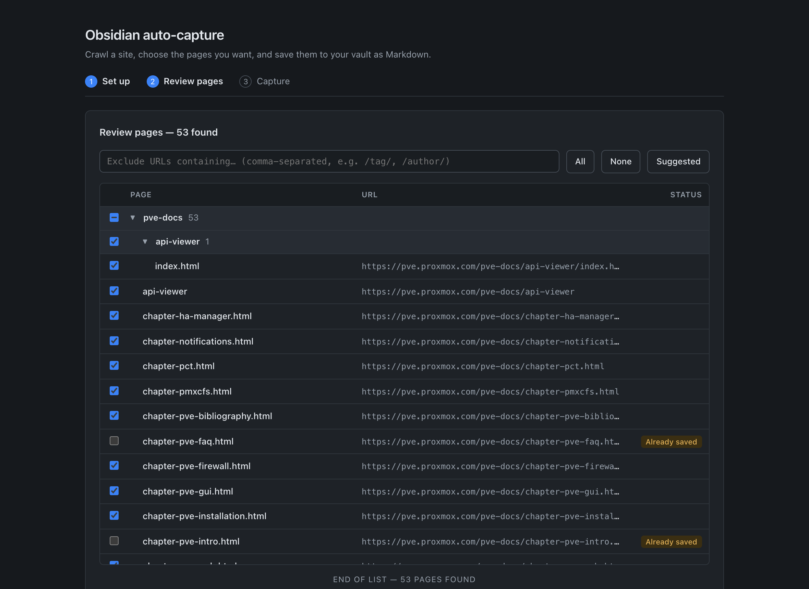
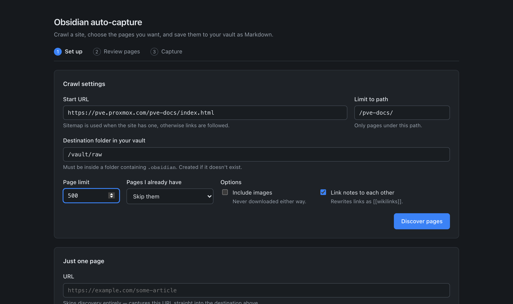
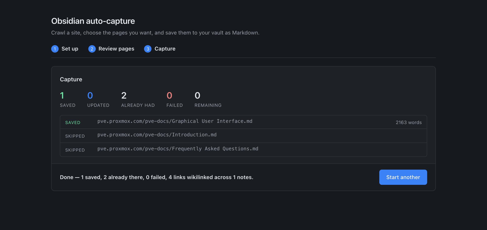

# Obsidian auto-capture

Crawl an entire website and save the pages into an [Obsidian](https://obsidian.md) vault as
Markdown — with links between the captured pages rewritten as `[[wikilinks]]`, so the result
is a connected set of notes instead of a folder of orphans.

It uses [`defuddle`](https://github.com/kepano/defuddle), the same extraction engine as the
official Obsidian Web Clipper, so notes come out with the clipper's frontmatter and Markdown
(including Obsidian-style callouts). No browser extension involved.



## Why

The Web Clipper is excellent for one page at a time. It can't do a whole documentation site,
because it hands each clip to Obsidian through the `obsidian://` URL scheme — one page, one
handoff. This is the bulk version: point it at a docs site, pick what you want from a tree,
and get the lot.

## What it does

- **Finds pages** via `sitemap.xml`, falling back to a same-origin link crawl.
- **Scopes the crawl** to a path, so `/docs/guides/` doesn't drag in 3,000 unrelated pages.
- **Lets you choose** — a folder tree with checkboxes, an exclude filter, and sensible defaults
  (`/tag/`, `/author/`, `/page/2` and query-string URLs start unticked).
- **Extracts article text**, dropping navigation, ads and boilerplate.
- **Falls back to a real browser** when a page turns out to be a JavaScript shell.
- **Links the notes together** so Obsidian's graph and backlinks work.
- **Knows what it already has**, so re-runs skip, update, or overwrite as you choose.

## Install

Requires Node 22+.

```bash
git clone https://github.com/EliasMarine/obsidian-auto-capture.git
cd obsidian-auto-capture
npm install
npm start
```

Open <http://127.0.0.1:4571>. The server binds to localhost only.

### Docker

```bash
cp .env.example .env      # point OBSIDIAN_VAULT at your vault folder
docker compose up -d
```

Same URL. The published port is bound to `127.0.0.1`, so it isn't exposed to your network.
The vault root is mounted at `/vault`, so the destination inside the container is `/vault/raw`.

## Using it



1. **Set up** — a start URL, a path to stay within, and a destination folder inside your vault.
   The destination must sit inside a folder containing `.obsidian`; the app refuses to write
   anywhere else.
2. **Review pages** — everything found, as a collapsible tree. Tick what you want.
3. **Capture** — writes the notes, then rewrites the links between them.

There's also a **Just one page** box that skips discovery entirely.



## Where notes land

Every site gets its own folder, so one capture never spills into another:

```
raw/
└── pve.proxmox.com/          ← hostname, www. stripped
    └── pve-docs/             ← mirrors the URL path
        ├── Introduction.md
        └── Frequently Asked Questions.md
```

Filenames come from the page title, falling back to the URL slug when a site puts its own
name in `og:title` on every page.

## Linked notes

After a capture, links *between* captured pages become Obsidian `[[wikilinks]]`. The pass runs
over the whole set rather than per page, so a note linking forward to a page captured later
still resolves. Links to pages you didn't capture, and anything inside a code fence, are left
exactly as they were. Turn it off with the **Link notes to each other** toggle.

## Re-running

`.crawl-index.json` in the destination folder maps each URL to its note and a hash of the
extracted content. **Pages I already have** controls what happens next time:

| Mode | Behaviour |
|---|---|
| Skip them | Existing notes are never touched (default) |
| Update if changed | Re-fetches, rewrites only pages whose content actually changed |
| Overwrite always | Rewrites everything, discarding local edits |

## JavaScript-rendered sites

Some sites send an empty shell and build the page in the browser. When extraction comes back
empty, the page is re-fetched through a headless browser and extracted again. Pages that work
over plain HTTP never launch a browser, so you only pay for it where it's needed.

This drives whatever Chrome, Edge or Chromium is already installed (via `playwright-core`)
rather than downloading its own. Set `OAC_NO_RENDER=1` to disable it entirely.

## Being a good citizen

`robots.txt` is respected, requests are rate-limited per host, and the page limit stops a
runaway crawl. Only crawl sites you're allowed to.

## Limits

- **Public pages only** — no login or cookie support.
- **Images are never downloaded.** With the toggle on you get remote `` links; off strips
  the markup entirely.
- **One job at a time** — it's a single-user local tool.

## Configuration

| Variable | Purpose |
|---|---|
| `PORT` | Port to listen on (default `4571`) |
| `OAC_HOST` | Bind address (default `127.0.0.1`; the image sets `0.0.0.0`) |
| `OAC_CONFIG` | Path to the settings file |
| `OAC_DEFAULT_DEST` | Destination used when no setting is saved yet |
| `OAC_BROWSER_PATH` | Explicit browser executable for rendering |
| `OAC_NO_RENDER` | Set to `1` to disable headless rendering |

## Tests

```bash
npm test
```

Covers URL→path mapping, filename sanitising, the write-outside-destination guard, YAML
escaping, scope narrowing, the link-list heuristic, and wikilink rewriting.

## License

MIT
